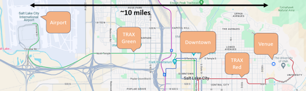

The WSSCI Spring Technical Meeting will be held on 4-5 March 2024 in Salt Lake City, Utah.

#### Conference Location

The conference will be held on the campus of University of Utah.

The conference will be held at the University of Utah campus in the [Warnock Engineering Building](https://maps.app.goo.gl/kpUoc55R6dPmcFLo8). The campus is conveniently located 10 miles from Salt Lake City International Airport and 5 miles from Downtown Salt Lake City. 

#### Accommodations

While group rates have not been organized with any specific hotel, there are many options available near campus and downtown. Good public transportation options exist between downtown and campus making downtown hotels a good option. Parking is also available near the conference venue. The closest two hotels are: 

1. [University Guest House](https://www.universityguesthouse.com/): 10 min. walking  
On campus, suites with two queen beds and one queen sofa bed, full kitchen (3 star, ~$240 per night with taxes)

2. [Salt Lake City Marriott University Park](https://www.marriott.com/en-us/hotels/slcup-salt-lake-city-marriott-university-park/overview/): 10 min. driving, 20 min. bus  
On the edge of campus, standard hotel room (3 star, ~$250 per night with taxes)

Many hotels are available downtown. These are often nicer and cheaper but require short travel to campus. One good recommendation is: 

3. [Little America Hotel](https://saltlake.littleamerica.com/): 10 min. driving, 30 min. rail  
Downtown, standard hotel room, very close to light rail stop (4 star, ~$175 per night with taxes) 

#### Travel

The University of Utah is located near Salt Lake City International Airport (SLC). Transportation options from the airport include driving, ride-share services like Uber and Lyft, public transportation, taxis, and hotel shuttles. The drive from the airport to downtown is approximately 10 minutes and to campus is approximately 20 minutes. There is light rail public transportation available between the airport and downtown (TRAX green line) and between downtown and campus (TRAX red line). Buses are also widely available. Please see the map below for more travel information. 

